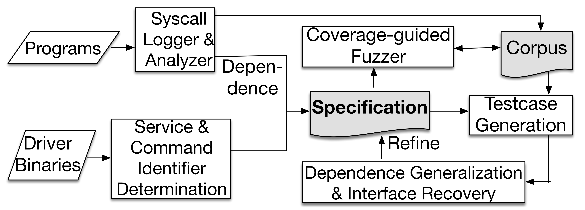

# Introduction
[SyzGen](https://www.cs.ucr.edu/~zhiyunq/pub/ccs21_syzgen.pdf) attempts to automate the generation of syscall specifications for closed-source macOS drivers and facilitate interface-aware fuzzing. We leverage two insights to overcome the challenges of binary analysis:(1) iterative refinement of syscall knowledge and (2) extraction and extrapolation of dependencies from a small number of execution traces.

# SyzGen_setup
	./setup.sh

# Overview



# Instruction

[SyzGen](SyzGen/docs/README.md): Automated Generation of Syscall Specification of Closed-Source macOS Drivers

[kcov](kcov/docs/README.md): Kernel module to provide coverage feedback

[hook](macOS-tools/README.md): Driver hook to collect logs


# Citation

```
Weiteng Chen, Yu Wang, Zheng Zhang, Zhiyun Qian. "SyzGen: Automated Generation of Syscall Specification of Closed-Source macOS Drivers." Proceedings of the 2021 ACM SIGSAC Conference on Computer and Communications Security (CCS)
```
